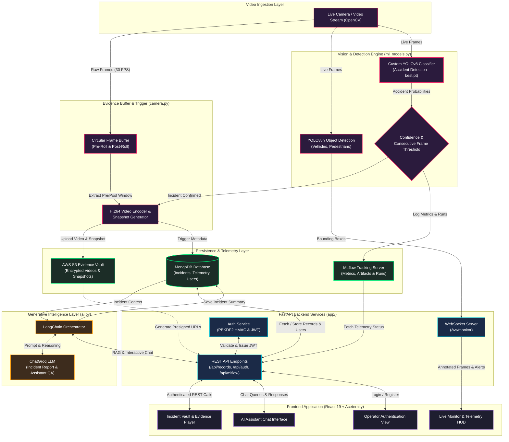

# System Architecture

```mermaid
flowchart TD
    %% Styling & Classes
    classDef client fill:#1e1e2f,stroke:#7952b3,stroke-width:2px,color:#fff
    classDef api fill:#1b2a47,stroke:#00bcd4,stroke-width:2px,color:#fff
    classDef vision fill:#2b1b3d,stroke:#e91e63,stroke-width:2px,color:#fff
    classDef storage fill:#1c2d27,stroke:#00e676,stroke-width:2px,color:#fff
    classDef ai fill:#3d2c1d,stroke:#ff9800,stroke-width:2px,color:#fff

    %% Input Source
    subgraph Ingestion ["Video Ingestion Layer"]
        CAM["Live Camera / Video Stream (OpenCV)"]
    end

    %% Computer Vision Pipeline
    subgraph VisionPipeline ["Vision & Detection Engine (ml_models.py)"]
        YOLO_DET["YOLOv8n Object Detection<br/>(Vehicles, Pedestrians)"]
        YOLO_CLS["Custom YOLOv8 Classifier<br/>(Accident Detection - best.pt)"]
        CONF_LOGIC{"Confidence &<br/>Consecutive Frame Threshold"}
    end

    %% Evidence & Trigger Processing
    subgraph BufferEngine ["Evidence Buffer & Trigger (camera.py)"]
        FRAME_BUF["Circular Frame Buffer<br/>(Pre-Roll & Post-Roll)"]
        ENCODER["H.264 Video Encoder &<br/>Snapshot Generator"]
    end

    %% Backend Services
    subgraph BackendCore ["FastAPI Backend Services (app/)"]
        WS_SRV["WebSocket Server<br/>(/ws/monitor)"]
        REST_API["REST API Endpoints<br/>(/api/records, /api/auth, /api/mlflow)"]
        AUTH_SVC["Auth Service<br/>(PBKDF2 HMAC & JWT)"]
    end

    %% Persistence & Storage
    subgraph Persistence ["Persistence & Telemetry Layer"]
        S3["AWS S3 Evidence Vault<br/>(Encrypted Videos & Snapshots)"]
        MONGO[("MongoDB Database<br/>(Incidents, Telemetry, Users)")]
        MLFLOW["MLflow Tracking Server<br/>(Metrics, Artifacts & Runs)"]
    end

    %% AI Analysis Layer
    subgraph AIIntelligence ["Generative Intelligence Layer (ai.py)"]
        LANGCHAIN["LangChain Orchestrator"]
        GROQ["ChatGroq LLM<br/>(Incident Report & Assistant QA)"]
    end

    %% Client Frontend
    subgraph FrontendApp ["Frontend Application (React 19 + Aceternity)"]
        UI_LIVE["Live Monitor & Telemetry HUD"]
        UI_INCIDENTS["Incident Vault & Evidence Player"]
        UI_CHAT["AI Assistant Chat Interface"]
        UI_AUTH["Operator Authentication View"]
    end

    %% Connections - Video Pipeline
    CAM -->|"Raw Frames (30 FPS)"| FRAME_BUF
    CAM -->|"Live Frames"| YOLO_DET
    CAM -->|"Live Frames"| YOLO_CLS

    YOLO_DET -->|"Bounding Boxes"| WS_SRV
    YOLO_CLS -->|"Accident Probabilities"| CONF_LOGIC

    CONF_LOGIC -->|"Incident Confirmed"| ENCODER
    FRAME_BUF -->|"Extract Pre/Post Window"| ENCODER

    %% Connections - Storage & Telemetry
    ENCODER -->|"Upload Video & Snapshot"| S3
    ENCODER -->|"Trigger Metadata"| MONGO
    CONF_LOGIC -->|"Log Metrics & Runs"| MLFLOW

    %% Connections - AI
    MONGO -->|"Incident Context"| LANGCHAIN
    LANGCHAIN <-->|"Prompt & Reasoning"| GROQ
    LANGCHAIN -->|"Save Incident Summary"| MONGO

    %% Connections - Backend API to Storage/AI
    S3 -.->|"Generate Presigned URLs"| REST_API
    MONGO <-->|"Fetch / Store Records & Users"| REST_API
    MLFLOW -->|"Fetch Telemetry Status"| REST_API
    AUTH_SVC <-->|"Validate & Issue JWT"| REST_API
    LANGCHAIN <-->|"RAG & Interactive Chat"| REST_API

    %% Connections - Frontend to Backend
    WS_SRV -->|"Annotated Frames & Alerts"| UI_LIVE
    REST_API <-->|"Authenticated REST Calls"| UI_INCIDENTS
    REST_API <-->|"Chat Queries & Responses"| UI_CHAT
    REST_API <-->|"Login / Register"| UI_AUTH

    %% Class Applications
    class UI_LIVE,UI_INCIDENTS,UI_CHAT,UI_AUTH client
    class WS_SRV,REST_API,AUTH_SVC api
    class YOLO_DET,YOLO_CLS,CONF_LOGIC,FRAME_BUF,ENCODER,CAM vision
    class S3,MONGO,MLFLOW storage
    class LANGCHAIN,GROQ ai
```
