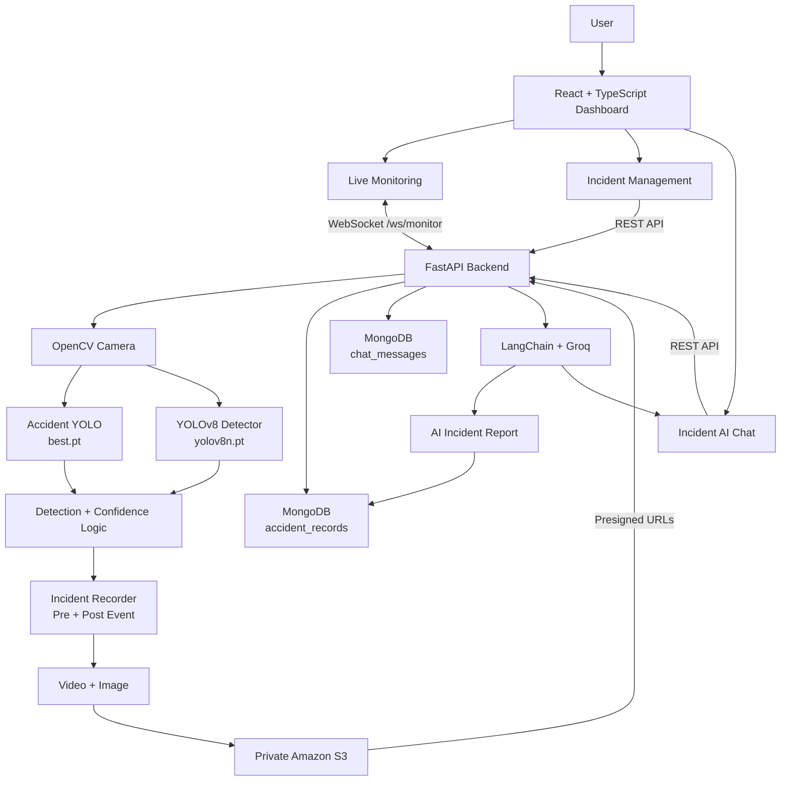

# CrashVision AI

> Real-time accident detection, evidence management, and AI-assisted incident analysis.

CrashVision AI monitors a live camera feed, detects potential road accidents, identifies scene objects, records evidence, stores incident data, generates AI reports, and provides an AI assistant for incident investigation.

## Features

- Real-time camera monitoring
- YOLO accident classification + YOLOv8 object detection
- Confidence and consecutive-frame accident confirmation
- Pre-event/post-event recording
- Automatic incident video and image capture
- Private Amazon S3 storage with presigned URLs
- MongoDB incident and chat persistence
- AI-generated reports and persistent incident chat
- Real-time WebSocket updates
- Responsive React incident dashboard

## Architecture



## End-to-End Flow

```text
Camera → OpenCV → YOLO Accident + Object Detection
       → Confidence/Consecutive-Frame Validation
       → Accident Confirmed
       → Pre/Post Event Recording
       → Video + Image → Private S3
       → Incident Metadata → MongoDB
       → AI Report → MongoDB
       → Incident Dashboard
       → Presigned Evidence URLs
       → Incident AI Chat → Persistent MongoDB Conversation
```

The monitoring WebSocket sends JPEG/base64 frames plus accident state, confidence, objects, recording state, and incident-processing state.

## Detection & Evidence

Models:

```text
ml/models/checkpoints/
├── best.pt       # Accident classification
└── yolov8n.pt    # Object detection
```

Key settings:

```env
FPS=30
CONFIDENCE_THRESHOLD=0.90
CONSECUTIVE_FRAMES_REQUIRED=10
PRE_EVENT_SECONDS=5
POST_EVENT_SECONDS=5
```

A confirmed accident combines buffered pre-event footage with post-event footage and creates an incident video plus representative image.

S3 object pattern:

```text
accidents/{record_id}/incident_{timestamp}.mp4
accidents/{record_id}/incident_{timestamp}.jpg
```

The S3 bucket remains private; the backend returns temporary presigned URLs to the frontend.

## Data & AI

MongoDB collections:

```text
accident_records
chat_messages
```

Incident records contain:

```text
record_id, created_at, status, accident,
confidence, objects, report, video, image
```

Chat messages use `record_id` and `conversation_id`, allowing persistent conversations per incident.

For completed incidents, LangChain + Groq generates reports and chat responses. The configured default model is `openai/gpt-oss-20b`.

Chat flow:

```text
Incident → Validate completed → Load conversation
         → LangChain/Groq → Save user + assistant messages
         → Return response + conversation_id
```

## Frontend

```text
frontend/
├── src/
│   ├── App.tsx
│   ├── index.css
│   └── components/
│       ├── LiveMonitoring.tsx
│       └── Incidents.tsx
├── package.json
└── vite.config.ts
```

- **App.tsx:** navigation, WebSocket, monitoring state, incidents, selection, chat, API calls.
- **LiveMonitoring.tsx:** live camera, detection status, confidence, objects, recording and controls.
- **Incidents.tsx:** incident list/details, evidence, reports, detection data, history and right-side AI chat panel.

## Backend

```text
backend/main.py
├── Configuration & model loading
├── Camera / OpenCV processing
├── Accident + object detection
├── Incident recording
├── S3 storage
├── MongoDB persistence
├── AI reports + chat
├── REST API
└── WebSocket monitoring
```

Blocking inference is moved through `asyncio.to_thread()` so the async FastAPI/WebSocket layer remains responsive.

## API

Base URL: `http://localhost:8000`

| Method | Endpoint | Purpose |
|---|---|---|
| GET | `/` | API status |
| GET | `/api/health` | Service health |
| GET | `/api/status` | Monitoring state |
| POST | `/api/start` | Start monitoring |
| POST | `/api/stop` | Stop monitoring |
| GET | `/api/records` | List incidents |
| GET | `/api/records/{record_id}` | Get incident |
| GET | `/api/records/{record_id}/conversations` | List conversations |
| GET | `/api/records/{record_id}/chat/history` | Conversation history |
| POST | `/api/records/{record_id}/chat` | Incident AI chat |
| WS | `/ws/monitor` | Live monitoring |

`/api/records` supports `limit` and `skip`.

Chat request:

```json
{
  "message": "Summarize this incident",
  "conversation_id": "optional-conversation-id"
}
```

Response:

```json
{
  "conversation_id": "conversation-id",
  "response": "AI response"
}
```

## WebSocket

```text
ws://localhost:8000/ws/monitor
```

Example:

```json
{
  "type": "frame",
  "frame": "base64-jpeg",
  "accident": false,
  "confidence": 0.0,
  "objects": [],
  "recording": false,
  "processing_incident": false
}
```

React renders the frame as `data:image/jpeg;base64,...`.

## Tech Stack

| Layer | Technologies |
|---|---|
| Frontend | React, TypeScript, Vite, Tailwind CSS |
| Backend | Python, FastAPI, Uvicorn, Pydantic |
| Computer Vision | OpenCV, Ultralytics YOLO |
| AI | LangChain, Groq, ChatGroq |
| Database | MongoDB |
| Storage | Amazon S3, Boto3 |
| Communication | REST, WebSocket |

## Configuration

Create `backend/.env`:

```env
CAMERA_INDEX=0
FPS=30
CONFIDENCE_THRESHOLD=0.90
CONSECUTIVE_FRAMES_REQUIRED=10
PRE_EVENT_SECONDS=5
POST_EVENT_SECONDS=5

AWS_ACCESS_KEY_ID=your-access-key
AWS_SECRET_ACCESS_KEY=your-secret-key
AWS_REGION=ap-south-1
S3_BUCKET_NAME=your-private-bucket

MONGODB_URI=mongodb://localhost:27017
MONGODB_DB=crashvision

GROQ_API_KEY=your-groq-api-key
GROQ_MODEL=openai/gpt-oss-20b
PRESIGNED_URL_EXPIRES=3600

FRONTEND_ORIGINS=http://localhost:5173,http://127.0.0.1:5173
API_HOST=0.0.0.0
API_PORT=8000
```

## Run Locally

### Prerequisites

Python 3.x, Node.js/npm, MongoDB, an AWS S3 bucket, Groq API key, working camera, and project dependencies.

### Backend

```bash
cd backend
pip install -r requirements.txt
python main.py
```

API: `http://localhost:8000`  
Docs: `http://localhost:8000/docs`

### Frontend

```bash
cd frontend
npm install
npm run dev
```

Dashboard: `http://localhost:5173`

Run backend and frontend in separate terminals.

## Project Structure

```text
accidentProject/
├── backend/
│   ├── main.py
│   ├── .env
│   ├── requirements.txt
│   └── recordings/
├── frontend/
│   ├── src/
│   │   ├── App.tsx
│   │   ├── index.css
│   │   └── components/
│   │       ├── LiveMonitoring.tsx
│   │       └── Incidents.tsx
│   ├── package.json
│   └── vite.config.ts
├── ml/
│   └── models/checkpoints/
│       ├── best.pt
│       └── yolov8n.pt
└── README.md
```

## Incident Lifecycle

```text
Live Monitor
    ↓
WebSocket + Camera Frames
    ↓
YOLO Inference
    ↓
Accident Confirmation
    ↓
Evidence Capture
    ↓
S3 Upload + MongoDB Record
    ↓
AI Report
    ↓
Incident Dashboard
    ↓
Presigned Evidence
    ↓
AI Investigation Chat
```

Statuses:

```text
processing → completed
      ↘
       failed
```

`processing` = still being processed.  
`completed` = ready for review/chat.  
`failed` = processing failed.

## Security

- Keep AWS credentials and Groq keys server-side.
- Keep the S3 bucket private.
- Use temporary presigned URLs for browser access.
- Never commit `.env` or secrets.
- Rotate credentials immediately if exposed.

Recommended `.gitignore`:

```gitignore
.env
.env.*
!.env.example
```

The application uses `record_id` as its incident identifier; MongoDB `_id` is separate.

## Troubleshooting

**Backend:** check `http://localhost:8000/api/health` and `ws://localhost:8000/ws/monitor`.

**Camera:** verify `CAMERA_INDEX` and ensure another application is not using the camera.

**AI:** verify `GROQ_API_KEY` and `GROQ_MODEL`.

**MongoDB:** verify `MONGODB_URI`, `MONGODB_DB`, and that MongoDB is running.

**S3:** verify `AWS_REGION`, `S3_BUCKET_NAME`, and AWS permissions. Use backend-generated presigned URLs rather than manually constructing private S3 URLs.

## Future Improvements

- Multi-camera / RTSP support
- Authentication and role-based access
- Incident severity and emergency notifications
- Search, analytics and dashboards
- MLflow tracking and automated retraining
- Docker/cloud deployment
- Background task queues and multi-camera scaling
- S3 retention policies

## Design Goals

**Detect** — identify accidents with computer vision.  
**Preserve** — capture and persist evidence.  
**Understand** — generate AI reports and analysis.  
**Review** — provide one workspace for incidents, evidence, metadata and conversations.

## License

Add your preferred license before publishing publicly.
