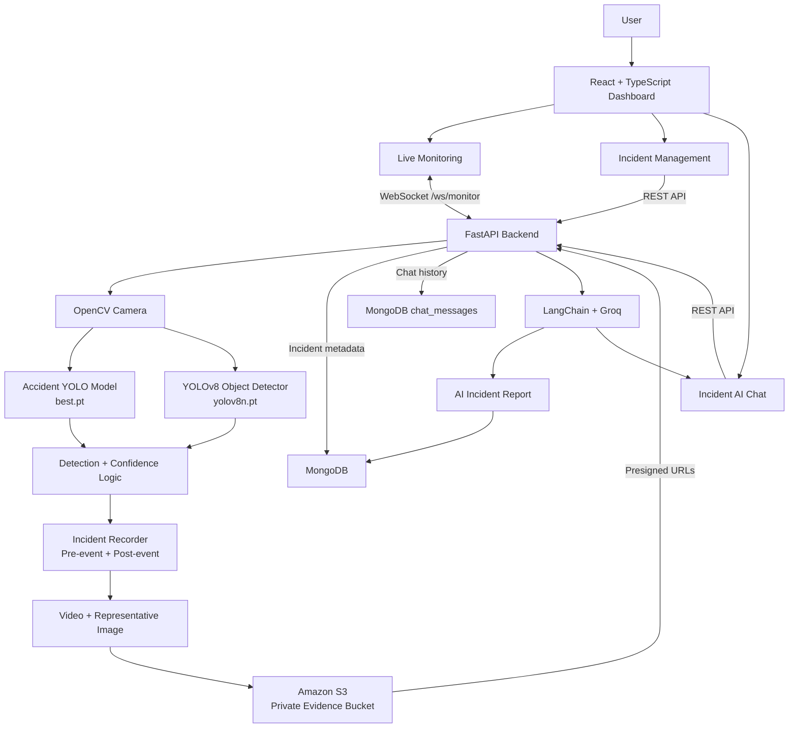

# CrashVision AI

> Real-time accident detection, incident intelligence, evidence management, and AI-assisted incident analysis.

CrashVision AI is an end-to-end computer vision application that monitors a live camera feed, detects potential road accidents, identifies objects in the scene, records evidence around confirmed incidents, stores incident media in Amazon S3, persists incident metadata and conversations in MongoDB, and provides an AI assistant for investigating individual incidents.

## Features

- Real-time camera monitoring
- YOLO-based accident classification
- YOLOv8 object detection
- Confidence-based accident detection
- Consecutive-frame confirmation to reduce false positives
- Pre-event and post-event recording
- Automatic incident video generation
- Representative incident image extraction
- Private Amazon S3 evidence storage
- Temporary S3 presigned URLs for browser playback
- MongoDB incident persistence
- Incident history and detailed incident pages
- AI-generated incident reports
- Context-aware incident chat
- Persistent chat conversations
- Real-time browser updates through WebSocket
- Responsive React dashboard
- Live monitoring and incident-management workspace

## Architecture



## High-Level Data Flow

### 1. Live monitoring

The browser connects to the FastAPI WebSocket at:

```text
ws://localhost:8000/ws/monitor
```

The backend reads frames from the configured camera using OpenCV and runs the detection pipeline. Processed frames are encoded as JPEG/base64 and sent to the React dashboard together with detection state.

The frontend receives:

- Current frame
- Accident state
- Accident confidence
- Detected objects
- Recording state
- Incident-processing state

### 2. Accident detection

The backend loads two YOLO models:

```text
ml/models/checkpoints/best.pt
ml/models/checkpoints/yolov8n.pt
```

`best.pt` is used for accident classification, while `yolov8n.pt` is used for object detection.

The detection pipeline uses configurable thresholds and consecutive-frame confirmation to avoid immediately creating an incident from a single uncertain frame.

Important configuration values include:

```text
CONFIDENCE_THRESHOLD=0.90
CONSECUTIVE_FRAMES_REQUIRED=10
FPS=30
PRE_EVENT_SECONDS=5
POST_EVENT_SECONDS=5
```

### 3. Evidence recording

When an accident is confirmed, CrashVision captures evidence around the event.

The recording workflow uses:

```text
Pre-event buffer
      +
Confirmed accident
      +
Post-event recording
      =
Incident video
```

A representative frame is also saved as incident image evidence.

The resulting media is uploaded to Amazon S3.

### 4. S3 evidence storage

Incident media is stored in a private S3 bucket.

The backend uploads:

```text
video/mp4
image/jpeg
```

Typical object keys follow the pattern:

```text
accidents/{record_id}/incident_{timestamp}.mp4
accidents/{record_id}/incident_{timestamp}.jpg
```

The bucket does not need to be publicly readable. The backend generates temporary presigned URLs which are returned to the frontend for video and image access.

This keeps AWS credentials and direct bucket access on the backend.

### 5. MongoDB persistence

MongoDB stores incident records and chat messages.

The main collections are:

```text
accident_records
chat_messages
```

An incident record contains information such as:

```text
record_id
created_at
status
accident
confidence
objects
report
video
image
```

Chat messages are associated with both:

```text
record_id
conversation_id
```

This allows multiple persistent conversations to exist for an incident.

### 6. AI incident reports

After an incident is processed, the backend can generate an AI report using LangChain and Groq.

The AI layer receives incident context and produces a human-readable report that can be reviewed from the incident details page.

The backend configuration uses:

```text
GROQ_API_KEY
GROQ_MODEL
```

The configured default model is:

```text
openai/gpt-oss-20b
```

### 7. Incident AI chat

Each completed incident can be investigated through the Incident AI chat.

The frontend sends a message containing:

```text
record_id
message
conversation_id
```

The backend:

1. Loads the incident from MongoDB.
2. Validates that the incident is completed.
3. Resolves or creates a conversation ID.
4. Loads persistent conversation context.
5. Generates an answer through LangChain/Groq.
6. Saves the user message.
7. Saves the assistant response.
8. Returns the response and conversation ID.

The UI presents the chat as a right-side panel while keeping the incident page visible.

## Frontend Architecture

The frontend is built with React, TypeScript, Vite, and Tailwind-style utility classes.

Main structure:

```text
frontend/
├── src/
│   ├── App.tsx
│   ├── index.css
│   └── components/
│       ├── LiveMonitoring.tsx
│       └── Incidents.tsx
├── package.json
└── vite.config.ts
```

### App.tsx

Responsible for the application shell and page-level state.

Main responsibilities:

- Navigation between Live Monitor and Incidents
- WebSocket connection
- Live monitoring state
- Incident list loading
- Incident selection
- Incident detail loading
- Chat state
- API communication

The dashboard has two primary workspace views:

```text
Live Monitor
Incidents
```

### LiveMonitoring.tsx

Displays the real-time monitoring experience.

It consumes state including:

```text
connected
monitoring
frame
accident
confidence
objects
recording
processingIncident
```

The camera frame is displayed as an image generated from the WebSocket's base64 JPEG payload.

The UI also exposes detection status, confidence, detected objects, recording state, and monitoring controls.

### Incidents.tsx

Provides the incident-management interface.

It contains:

- Incident list
- Incident statistics
- Incident detail page
- Evidence video
- Evidence image
- AI-generated report
- Detection details
- Incident AI chat
- Chat toggle
- Chat history
- Chat input

The chat uses a fixed right-side panel so the underlying incident page remains visible.

## Backend Architecture

The backend is a FastAPI application.

Conceptually:

```text
backend/
└── main.py
    ├── Configuration
    ├── Model loading
    ├── Camera management
    ├── Accident detection
    ├── Object detection
    ├── Recording
    ├── S3 storage
    ├── MongoDB persistence
    ├── AI report generation
    ├── AI chat
    ├── REST endpoints
    └── WebSocket monitoring
```

### Camera and processing loop

The monitoring loop:

```text
Camera frame
    ↓
OpenCV
    ↓
YOLO inference
    ↓
Accident classification
    ↓
Object detection
    ↓
Detection state
    ↓
Incident confirmation
    ↓
Evidence recording
    ↓
WebSocket → React
```

The backend uses `asyncio.to_thread()` for CPU/blocking processing so the asynchronous FastAPI/WebSocket layer can continue operating while inference work is performed.

## API

Base URL:

```text
http://localhost:8000
```

### Health

```http
GET /
GET /api/health
GET /api/status
```

`/api/health` reports backend/service state including camera, Groq, MongoDB, S3, configured models, AWS region, and S3 bucket state.

### Monitoring

Start monitoring:

```http
POST /api/start
```

Stop monitoring:

```http
POST /api/stop
```

Live monitoring:

```text
WS /ws/monitor
```

### Incidents

List incidents:

```http
GET /api/records
```

The endpoint supports:

```text
limit
skip
```

Get one incident:

```http
GET /api/records/{record_id}
```

### Conversations

List conversations for an incident:

```http
GET /api/records/{record_id}/conversations
```

Load conversation history:

```http
GET /api/records/{record_id}/chat/history?conversation_id={conversation_id}
```

Send an incident chat message:

```http
POST /api/records/{record_id}/chat
```

Request body:

```json
{
  "message": "Summarize this incident",
  "conversation_id": "optional-conversation-id"
}
```

Response:

```json
{
  "conversation_id": "conversation-id",
  "response": "AI response"
}
```

## WebSocket Protocol

The frontend connects to:

```text
ws://localhost:8000/ws/monitor
```

The backend sends frame messages containing fields such as:

```json
{
  "type": "frame",
  "frame": "base64-jpeg",
  "accident": false,
  "confidence": 0.0,
  "objects": [],
  "recording": false,
  "processing_incident": false
}
```

The React application converts the JPEG payload into:

```text
data:image/jpeg;base64,...
```

and renders it in the monitoring interface.

## Technology Stack

### Frontend

| Technology | Purpose |
|---|---|
| React | UI framework |
| TypeScript | Type-safe frontend development |
| Vite | Development server and build tooling |
| Tailwind CSS utilities | UI styling |
| WebSocket API | Real-time monitoring |
| Fetch API | REST communication |

### Backend

| Technology | Purpose |
|---|---|
| Python | Backend and ML processing |
| FastAPI | REST API and WebSocket server |
| Uvicorn | ASGI server |
| OpenCV | Camera capture and video processing |
| Ultralytics YOLO | Accident and object detection |
| Pydantic | Request/response validation |
| python-dotenv | Environment configuration |

### AI

| Technology | Purpose |
|---|---|
| LangChain | LLM orchestration and conversation handling |
| Groq | LLM inference |
| ChatGroq | LangChain integration with Groq |

### Storage

| Technology | Purpose |
|---|---|
| MongoDB | Incident and conversation persistence |
| Amazon S3 | Private incident video/image storage |
| Boto3 | AWS S3 integration |

## Environment Configuration

Create a `.env` file in the backend directory.

Example:

```env
CAMERA_INDEX=0
FPS=30
CONFIDENCE_THRESHOLD=0.90
CONSECUTIVE_FRAMES_REQUIRED=10
PRE_EVENT_SECONDS=5
POST_EVENT_SECONDS=5

AWS_ACCESS_KEY_ID=your-access-key
AWS_SECRET_ACCESS_KEY=your-secret-key
AWS_REGION=ap-south-1
S3_BUCKET_NAME=your-private-bucket

MONGODB_URI=mongodb://localhost:27017
MONGODB_DB=crashvision

GROQ_API_KEY=your-groq-api-key
GROQ_MODEL=openai/gpt-oss-20b

PRESIGNED_URL_EXPIRES=3600

FRONTEND_ORIGINS=http://localhost:5173,http://127.0.0.1:5173

API_HOST=0.0.0.0
API_PORT=8000
```

Never commit `.env` or cloud credentials to Git.

## Model Files

The backend expects:

```text
ml/
└── models/
    └── checkpoints/
        ├── best.pt
        └── yolov8n.pt
```

`best.pt` is the accident-classification model.

`yolov8n.pt` is the YOLOv8 object-detection model.

The backend validates that both model files exist during startup.

## Running the Project

### Prerequisites

Install:

- Python 3.x
- Node.js and npm
- MongoDB
- An AWS account with an S3 bucket
- A Groq API key
- A working camera
- Required Python and frontend dependencies

### Start the backend

From the backend directory:

```bash
pip install -r requirements.txt
python main.py
```

The API runs on:

```text
http://localhost:8000
```

FastAPI documentation is available at:

```text
http://localhost:8000/docs
```

### Start the frontend

From the frontend directory:

```bash
npm install
npm run dev
```

The Vite application runs at:

```text
http://localhost:5173
```

### Start both services

Use two terminals.

Terminal 1:

```bash
cd backend
python main.py
```

Terminal 2:

```bash
cd frontend
npm run dev
```

Open:

```text
http://localhost:5173
```

## Typical Incident Lifecycle

```text
1. User opens Live Monitor
          ↓
2. React connects to /ws/monitor
          ↓
3. FastAPI starts camera processing
          ↓
4. OpenCV reads frames
          ↓
5. Accident model evaluates the frame
          ↓
6. Object detector identifies scene objects
          ↓
7. Consecutive detections confirm an accident
          ↓
8. Pre-event + post-event evidence is collected
          ↓
9. Video and image are uploaded to S3
          ↓
10. Incident metadata is saved in MongoDB
          ↓
11. AI report is generated
          ↓
12. Incident appears in the Incidents page
          ↓
13. User opens incident details
          ↓
14. Evidence is loaded using presigned S3 URLs
          ↓
15. User opens Incident AI
          ↓
16. Conversation is persisted in MongoDB
```

## Incident Status

Incidents can have states such as:

```text
processing
completed
failed
```

### processing

The incident is still being processed. Evidence and AI report generation may not be finished.

### completed

The incident is ready for review and AI chat.

### failed

The backend could not complete incident processing.

## Security Considerations

### AWS credentials

AWS credentials must remain server-side.

Do not expose:

```text
AWS_ACCESS_KEY_ID
AWS_SECRET_ACCESS_KEY
```

to the React application.

### Private S3 bucket

Incident evidence should remain private.

The frontend should receive temporary presigned URLs rather than permanent public S3 URLs.

### Environment variables

Keep secrets in `.env` and add the file to `.gitignore`.

Recommended:

```gitignore
.env
.env.*
!.env.example
```

### API keys

Never commit:

```text
GROQ_API_KEY
AWS_SECRET_ACCESS_KEY
```

to source control.

If a credential is accidentally exposed, revoke/rotate it immediately.

## Development Notes

### CORS

The backend allows configured frontend origins through:

```text
FRONTEND_ORIGINS
```

The default local development origins are:

```text
http://localhost:5173
http://127.0.0.1:5173
```

### S3 URLs

S3 media is accessed through backend-generated temporary URLs.

If the S3 bucket is private, opening the raw object URL directly from the browser is not the intended access path.

### Application record IDs

The application uses `record_id` as the incident identifier.

MongoDB's internal `_id` is separate from the application-level incident ID.

The frontend and incident API routes use the application `record_id`.

## Project Structure

A recommended project layout is:

```text
accidentProject/
├── backend/
│   ├── main.py
│   ├── .env
│   ├── requirements.txt
│   └── recordings/
│
├── frontend/
│   ├── src/
│   │   ├── App.tsx
│   │   ├── index.css
│   │   └── components/
│   │       ├── LiveMonitoring.tsx
│   │       └── Incidents.tsx
│   ├── package.json
│   └── vite.config.ts
│
├── ml/
│   └── models/
│       └── checkpoints/
│           ├── best.pt
│           └── yolov8n.pt
│
└── README.md
```

## Design Goals

CrashVision AI is designed around four main goals:

### Detect

Identify potential accidents from a live camera stream using computer vision.

### Preserve

Automatically capture and persist evidence surrounding confirmed incidents.

### Understand

Use AI-generated reports and conversational analysis to make incident information easier to interpret.

### Review

Provide a dashboard where users can inspect incidents, evidence, detection metadata, reports, and conversations from one workspace.

## Future Improvements

Potential next steps include:

- Multi-camera monitoring
- RTSP/IP camera support
- Authentication and role-based access
- Incident severity classification
- Email/SMS emergency notifications
- Real-time emergency response workflows
- Better incident filtering and search
- Incident analytics and dashboards
- Model performance monitoring with MLflow
- Model versioning and experiment tracking
- Automated model retraining
- Docker-based deployment
- Cloud deployment
- Background task processing with a dedicated queue
- Horizontal scaling for multiple camera streams
- Automated retention policies for S3 evidence

## Troubleshooting

### Frontend cannot connect to backend

Check that FastAPI is running:

```text
http://localhost:8000/api/health
```

Check the WebSocket endpoint:

```text
ws://localhost:8000/ws/monitor
```

### Camera does not start

Check:

```env
CAMERA_INDEX=0
```

and make sure another application is not using the camera.

### AI report/chat does not work

Verify:

```env
GROQ_API_KEY=...
GROQ_MODEL=...
```

The backend reports when the Groq integration is not configured.

### MongoDB problems

Verify:

```env
MONGODB_URI=mongodb://localhost:27017
MONGODB_DB=crashvision
```

and make sure MongoDB is running.

### S3 problems

Verify:

```env
AWS_REGION=...
S3_BUCKET_NAME=...
```

and confirm the AWS credentials have permission to upload and read objects from the bucket.

For browser playback, use the presigned URL returned by the backend rather than manually constructing an S3 object URL.

## API Summary

| Method | Endpoint | Purpose |
|---|---|---|
| GET | `/` | API status |
| GET | `/api/health` | Service health |
| GET | `/api/status` | Monitoring state |
| POST | `/api/start` | Start camera monitoring |
| POST | `/api/stop` | Stop monitoring |
| GET | `/api/records` | List incidents |
| GET | `/api/records/{record_id}` | Get incident |
| GET | `/api/records/{record_id}/conversations` | List incident conversations |
| GET | `/api/records/{record_id}/chat/history` | Get conversation history |
| POST | `/api/records/{record_id}/chat` | Chat about an incident |
| WebSocket | `/ws/monitor` | Real-time monitoring stream |

## License

Add your preferred license here before publishing the project publicly.

---

## Summary

CrashVision AI combines computer vision, real-time streaming, cloud storage, database persistence, and generative AI into a single incident-intelligence workflow:

```text
Camera
  ↓
Computer Vision
  ↓
Accident Detection
  ↓
Evidence Capture
  ↓
S3 + MongoDB
  ↓
AI Report
  ↓
Incident Dashboard
  ↓
AI Investigation Chat
```

The result is a complete pipeline for detecting, preserving, understanding, and reviewing road-accident incidents.
